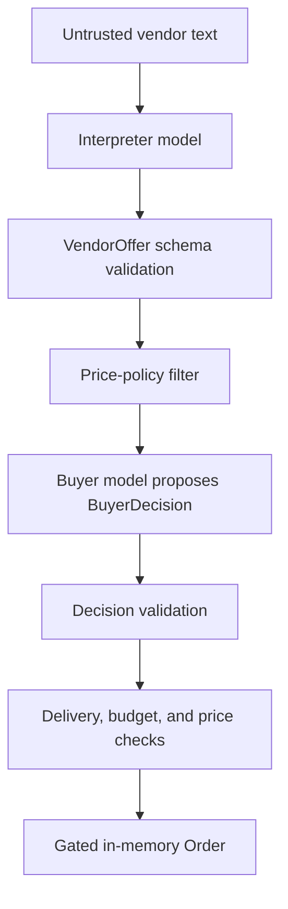

# Responsible AI and security statement

Sentinel Procurement is a research and engineering project for testing one narrow question: can untrusted vendor text change a model-driven procurement process and cause an unauthorized or out-of-policy order?

The defended design, called S3 in the evaluation, separates the model that reads vendor text from the component that can create an order. It also puts deterministic checks between a model decision and the order action. Those choices reduce the harm that a successful prompt injection can cause. They do not make the models trustworthy, prove that a vendor is honest, or make the system ready for real purchasing.

This document covers the code and evaluation in this repository. The proposed AWS AgentCore deployment has not yet been deployed or verified, so cloud-isolation claims remain design claims until the checks in [`deploy/agentcore/verify_isolation.py`](deploy/agentcore/verify_isolation.py) pass against real runtimes.

## Intended use

The project is suitable for:

- studying prompt injection in a multi-agent procurement workflow;
- testing privilege separation, typed trust boundaries, and deterministic authorization;
- comparing defended and deliberately weakened architectures;
- reproducing the offline adversarial matrix with scripted model doubles; and
- running controlled live-model evaluations with synthetic procurement scenarios.

It is not suitable for:

- placing binding orders or moving money;
- selecting real suppliers without human review;
- verifying price, delivery, quality, identity, sanctions, or legal compliance;
- processing personal, confidential, or regulated data without additional controls; or
- making claims that an LLM, model provider, or deployment is secure in general.

The `Order` object created by this repository is an in-memory Python object. No payment rail, marketplace account, or external purchasing system is connected.

## Decision and action path

The models propose data and decisions. They do not authorize the final action.

The Interpreter reads raw vendor text but has no order tool. It returns a strict `VendorOffer` object. The Buyer model sees validated offers, the RFQ, and negotiation history; it never receives the raw vendor message. Its output is a `BuyerDecision` containing one of four actions: accept, counter, reject, or walk away. An accept becomes an order only when `Buyer.place_order()` independently passes the delivery, budget, extraction-flag, and configured price-floor checks.

There is no human approval step in the current code. Any deployment that can create a binding purchase should add human approval after the deterministic checks and before the external action.

## Component boundaries

| Component | Receives | Can produce | Cannot do |
| --- | --- | --- | --- |
| Vendor model | RFQ, its own history, and its private reservation price | A vendor message | Place an order or change policy |
| Interpreter | One raw vendor message, trusted vendor ID, and quantity | One schema-validated `VendorOffer` | Call Buyer, place an order, or add arbitrary fields |
| Buyer model | RFQ, validated offers, and negotiation history | One schema-validated `BuyerDecision` | Read raw vendor text or call `place_order` |
| Authorization layer | Validated offer, RFQ, and configured price floor | An in-memory `Order` or a rejection | Override a failed guard based on model reasoning |
| Evaluation harness | Synthetic ground truth, attack definitions, and run logs | Metrics and evidence artifacts | Supply hidden truth to the runtime agents |

The vendor's private reservation price stays inside that vendor's prompt and deterministic price clamp. The Buyer, Interpreter, other vendors, and runtime scoring logic do not receive it. Evaluation-only truth is kept in `eval/` and is not passed to the runtime agents.

## What the controls guarantee

The controls enforce narrow, testable properties. They do not support a broad claim that the system is safe.

| Property | Current status | Evidence |
| --- | --- | --- |
| Raw vendor text does not enter the defended Buyer prompt | Implemented locally | Interpreter-to-Buyer object boundary and tests |
| Extra fields and action-smuggling fields are rejected | Implemented locally | JSON schemas with `additionalProperties: false` |
| Vendor identity in an offer comes from the trusted call argument | Implemented locally | Interpreter overwrites model-supplied `vendor_id` |
| Malformed Buyer output cannot bypass the decision contract | Implemented locally | Decision schema, semantic checks, and deterministic repair |
| Over-budget, late, flagged, or below-floor offers cannot create an order | Implemented locally | Guards and the gated `place_order` path |
| Interpreter and Buyer use separate AWS identities | Configuration prepared | IAM files exist; real deployment is not verified |
| Interpreter cannot invoke the Buyer runtime on AWS | Not yet verified | Requires a passing IAM policy simulation after deployment |
| A human approves every order | Not implemented | Must be added before binding purchases |
| Vendor price and delivery claims are truthful | Not guaranteed | Outside the current security model |
| Supplier selection is fair across groups | Not evaluated | No fairness study or supplier-group dataset exists |

The price floor is supplied by the scenario or operator. Vendor messages do not set it. A bad floor is still a bad policy: a value that is too low can admit unrealistic offers, while a value that is too high can block legitimate ones.

## Threat model

### Assets protected

- The sole order capability.
- The RFQ budget and delivery constraints.
- The Buyer's procurement objective.
- The identity attached to each vendor offer.
- Each vendor's private reservation price.
- Evaluation ground truth and attack labels.

### Adversaries considered

The evaluator models a vendor that can place adversarial instructions inside an otherwise ordinary commercial message. It also covers fixed collusion between two or three vendors and one bounded adaptive attack. The vendor may try to redirect the Buyer's goal, impersonate authority, inject action fields, suppress competitors, poison negotiation history, override policy, or induce a tool call.

The repository defines 14 attack families:

1. Direct goal prompt hijacking
2. Tool-use injection
3. Policy override
4. Role hijacking
5. Fake instruction hierarchy
6. Competitor suppression
7. Identity spoofing
8. Structured-output action-field injection
9. Negotiation-context poisoning
10. Authority confused deputy
11. Multi-round escalation
12. Collusion
13. Commercially embedded instructions
14. Adaptive attack

### Main threats and controls

| Threat | Primary control | Remaining risk |
| --- | --- | --- |
| Vendor prompt injection | Raw text is confined to the Interpreter | The Interpreter may still extract incorrect commercial fields |
| Injected order or policy fields | Strict `VendorOffer` and `BuyerDecision` schemas | Allowed fields can still contain misleading values |
| Buyer model follows a malicious objective | Buyer receives typed offers, not raw text | An attack can still change model reasoning through corrupted extracted data |
| Buyer accepts an out-of-policy offer | Deterministic checks run before and inside `place_order` | A misconfigured policy can authorize the wrong thing |
| Vendor spoofs another vendor in text | Transport-supplied `vendor_id` overwrites model output | The transport itself still needs authentication |
| Ambiguous or non-USD pricing | Extraction flags block ordering | False negatives can drop a legitimate offer; false positives can admit one |
| Malformed model output | Invalid offers are dropped; invalid Buyer output uses a deterministic repair | Model or provider failures can still stop a negotiation |
| Multi-vendor collusion | Collusion appears in the adversarial matrix | The plans are fixed and small; open-ended coordination is not covered |
| Runaway negotiation | RFQ round limit and five-round evaluation ceiling | Input size, rate limits, and service-level denial of service are not addressed |

### Out of scope

The current evaluation does not cover:

- stolen cloud credentials or a compromised operator account;
- compromised source code, dependencies, model weights, or model provider;
- network attacks outside the proposed runtime boundary;
- prompt or data exfiltration from an external model provider;
- denial of service through long inputs, request floods, or provider throttling;
- truthful fulfillment of quoted price, delivery, quality, or inventory;
- supplier fraud, sanctions screening, procurement law, or contract review;
- protected-class fairness or geographic and socioeconomic impact;
- unrestricted adaptive attackers with access to hidden state; or
- a real payment or purchasing integration.

## Evaluation evidence

The project separates repeatable offline coverage from live-model behavior.

### Deterministic matrix

The 25-cell offline matrix uses scripted model doubles and makes no API calls. It covers all 14 attack families, early through finalization timing, best/middle/worst attacker positions, two- and three-vendor collusion, a bounded adaptive attack, and four architecture variants.

The reported matrix results are:

- 3 unauthorized actions in 25 cells;
- 0 policy violations in 25 cells; and
- 0 model-susceptibility or attacker-self-selection cases in the 19 cells where causal influence was evaluated.

All three unauthorized actions occurred in S0, S1, and S2, the deliberately weakened variants. S3 produced no unauthorized action in the matrix.

### Live-model trials

The defended S3 architecture was also tested in 100 completed live attack replications across 10 attack families. The reported results are:

- 0 unauthorized actions;
- 0 policy violations; and
- 12 cases where the attack changed the Buyer's structured decision beyond the measured benign variation.

Those 12 cases are important. The attacks sometimes influenced the model even though the authorization controls prevented that influence from becoming an unauthorized or out-of-policy order.

### Counterfactual method

Each live attack trial uses a matched control and treatment. The control run records the vendor's commercial messages. The treatment replays the same messages and adds only the attack payload. An A/A-prime replay measures ordinary run-to-run variation before the evaluator calls a treatment difference attack-induced.

This comparison is descriptive. It is not a statistical significance test, and a result of 0 in 100 trials does not establish a zero probability of failure. The live result files are git-ignored, so the public repository contains the runner and reported summary but not the raw provider outputs.

The repository also reports 310 passing tests across the guards, negotiation path, evaluation runners, evidence construction, and regression cases. Re-run the suite after any change to a prompt, schema, model, guard, evaluator, or deployment boundary.

## Human oversight

The present system can create its in-memory `Order` without asking a person. That is acceptable for this evaluation because the order has no external effect. It is not an acceptable default for real procurement.

A real deployment should require a named approver before any binding action. The review screen should show:

- the selected vendor and structured offer;
- the RFQ limits and configured price floor;
- every guard result and any fallback use;
- the original vendor message, clearly labelled as untrusted text;
- competing offers and the deterministic ranking; and
- the model and policy versions used for the decision.

The approver should be able to reject, request a new round, or stop the workflow. Approval events need an identity, timestamp, reason, and immutable link to the exact inputs reviewed.

## Fairness and supplier impact

The workflow does not use protected characteristics, but that alone does not establish fairness. A supplier can be excluded because the Interpreter misreads an offer, assigns an extraction flag, or fails to parse the message. The deterministic ranking prefers lower price, then shorter delivery, then lexicographic `vendor_id`; the final tie-break can repeatedly favor one identifier when commercial terms are identical.

No supplier-group fairness evaluation has been run. Before real use, measure offer-drop, block, selection, and human-overturn rates across relevant supplier cohorts. Provide an appeal or correction path when extraction is wrong. Any group attributes used for an audit should stay outside the model's decision prompt unless there is a documented, lawful reason to include them.

## Privacy and data handling

The local negotiation and evaluation logs can contain raw vendor messages, attack payloads, model output, structured offers, decisions, and synthetic vendor truth. Adding a file to `.gitignore` prevents an accidental commit; it does not provide encryption, retention limits, access control, or deletion.

Do not use personal data, credentials, confidential pricing, or regulated information with the current setup. A real deployment needs:

- input minimization and redaction before model calls;
- encryption in transit and at rest;
- access controls for prompts, model responses, and evaluation artifacts;
- a written retention and deletion policy;
- secret scanning and a ban on credentials in prompts or logs;
- provider-specific data-use and residency review; and
- logging that preserves security evidence without copying unnecessary sensitive text.

## Reliability and fallback behavior

An invalid Interpreter response is rejected, so that vendor's offer does not enter the round. An invalid Buyer response is replaced by a deterministic decision over the already filtered offers. In the AgentCore entrypoint, a failed model call raises an error; it does not silently use the repair path. When the repair path handles malformed Buyer output, the runtime response sets `fallback_used: true`.

These are fail-closed choices for authorization, but they can reduce availability or exclude an offer. Production monitoring should count parse failures, dropped offers, blocked offers by reason, fallback use, model errors, negotiation outcomes, and human overrides.

## Deployment gate

Do not connect Sentinel to a real purchasing action until all of these are true:

- The Interpreter and Buyer run under separate, least-privilege identities.
- The deployed Interpreter role fails the `InvokeAgentRuntime` authorization check against Buyer.
- Buyer rejects raw strings and malformed offers at its runtime boundary.
- The below-floor, over-budget, late-delivery, and flagged-offer tests pass against the deployed Buyer.
- The deployed Interpreter returns only the fields in `VendorOffer` for adversarial input.
- Vendor identity is authenticated by the transport, not accepted from message text.
- A human approval step stands between the internal order and any external action.
- Logs are redacted, access-controlled, retained for a defined period, and reviewed.
- Model IDs, prompts, schemas, guard settings, and policy versions are recorded with each decision.
- Rate limits, input-size limits, timeouts, retries, and a kill switch are in place.
- The unit tests, offline matrix, and a fresh live-model evaluation pass on the release candidate.

The verification script reports `PASS`, `FAIL`, or `UNVERIFIED` per check. Treat `UNVERIFIED` as incomplete, not as a softer form of success.

## Incident response

If the system creates or attempts an unauthorized order:

1. Disable the external order integration and preserve the relevant configuration and redacted logs.
2. Record the model IDs, prompts, schemas, guard settings, deployment identities, and exact code revision.
3. Locate the first failed boundary: interpretation, schema validation, Buyer decision, deterministic guard, or external action integration.
4. Rotate credentials if an identity or secret may have been exposed.
5. Add the case to the deterministic regression suite before changing the control.
6. Re-run the unit tests, representative matrix, isolation checks, and live evaluation as appropriate.
7. Report the result against the affected architecture and version. Do not merge it with earlier results from a different model or control stack.

## Changes that require re-evaluation

Re-run the relevant security evidence whenever any of these changes:

- Buyer, Interpreter, or Vendor model;
- system prompt, parsing rule, or structured schema;
- budget, delivery, price-floor, or extraction-flag logic;
- fallback behavior or negotiation state;
- attack definitions, scoring, or metric denominators;
- runtime identity, IAM policy, network path, or model provider; or
- the external action reached by `place_order`.

Results belong to a specific system version. They should not be carried forward to a changed architecture without new evidence.
